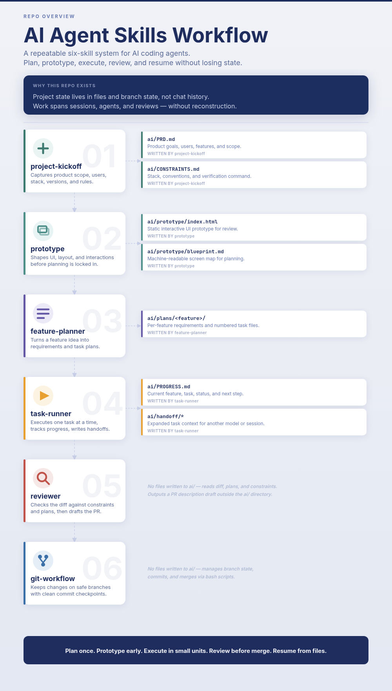

# AI Agent Skills Workflow



This repository contains a small set of Markdown instruction files and shell
scripts for running structured software projects with AI coding agents.

It is for developers who use tools like Claude Code, Codex, OpenCode, or any
agent that can read local instruction files and follow a repeatable workflow.
The goal is to keep product context, technical constraints, feature plans,
implementation progress, handoffs, and git mechanics explicit enough that work
can span multiple sessions and even multiple AI models without losing the plot.

## The Pipeline

The four skills are designed to feed each other:

```text
project-kickoff (once per project)
|-- ai/CONSTRAINTS.md    technical stack, versions, conventions, verification
`-- ai/PRD.md            product goals, users, features, scope

feature-planner (per feature)
|-- Phase 1: requirements interview  -> ai/plans/<feature>/requirements.md
`-- Phase 2: plan file generation    -> ai/plans/<feature>/01-*.md

task-runner (implementation)
`-- reads CONSTRAINTS.md, PRD.md, requirements, and plan files

git-workflow (underneath task-runner)
`-- branches, commits, and end-of-task summaries via bash scripts
```

Each step produces files the next step reads. The agent does not need to
reconstruct context from chat history because the important state is written
into the project.

## End-to-End Workflow

### Day 1: Planning

```text
1. Run project-kickoff.
   - Interview for product scope and technical stack.
   - Research versions with the three-month staleness rule.
   - Produce ai/CONSTRAINTS.md and ai/PRD.md.

2. Run feature-planner for each feature.
   - Phase 1 writes ai/plans/<feature>/requirements.md.
   - Phase 2 writes numbered plan files.

3. Run task-runner init.
   - Pick the current feature.
   - Create ai/PROGRESS.md.
   - Set the first incomplete task.
```

### Day 1-N: Implementation

```text
1. Resume or start a task.
2. task-runner reads constraints, PRD, requirements, plans, and progress.
3. git-workflow-start creates or selects the work branch.
4. The agent implements one atomic task.
5. The agent runs the task verification command.
6. task-runner marks the task [DONE] and updates ai/PROGRESS.md.
7. git-workflow-commit commits the implementation and state updates.
8. git-workflow-end prints the branch summary and suggested next steps.
9. snapshot saves state before stopping.
```

### Switching Models

```text
1. Ask task-runner to hand off task 2.3.
2. It writes ai/handoff/<feature>-task-2.3-<slug>.md.
3. Open a new session with another model.
4. Ask it to resume.
5. The new model reads PROGRESS.md, requirements.md, plan files, and handoff.
```

### When Plans Go Stale

```text
1. Earlier features change the codebase.
2. Re-run feature-planner Phase 2 for the affected feature.
3. It reads the existing requirements, scans the current codebase, preserves
   [DONE] tasks, and regenerates incomplete tasks.
```

## Installation

These skills are plain directories containing `SKILL.md` files. Install them
where your agent expects local skills.

> I use my Laravel and React background in the skills context. Feel free to update them to match your expertise.

For Codex:

```bash
mkdir -p ~/.agents/skills
cp -R skills/project-kickoff skills/feature-planner skills/task-runner skills/git-workflow ~/.agents/skills/
```

For Claude Code `~/.claude/skills`, copy them there instead:

```bash
mkdir -p ~/.claude/skills
cp -R skills/project-kickoff skills/feature-planner skills/task-runner skills/git-workflow ~/.claude/skills/
```

> Or you can symlink like me and just use `~/agents/skills` as the default skills directory.
> `ln -s /home/yan/.agents/skills /home/yan/.claude/skills`

Install the git workflow scripts onto your `PATH`:

```bash
mkdir -p ~/.local/bin
cp scripts/git-workflow-start ~/.local/bin/
cp scripts/git-workflow-commit ~/.local/bin/
cp scripts/git-workflow-end ~/.local/bin/
chmod +x ~/.local/bin/git-workflow-*
```

Make sure `~/.local/bin` is on your `PATH`:

```bash
export PATH="$HOME/.local/bin:$PATH"
```

Add that line to your shell profile if needed.

Verify the scripts:

```bash
git-workflow-start
git-workflow-commit
git-workflow-end
```

The first two commands should print usage text when called without the required
arguments. `git-workflow-end` should be run inside a git repository.

## Repository Layout

This repo currently stores each skill under `skills/`, with executable helpers
under `scripts/`:

```text
.
|-- README.md
|-- skills/
|   |-- project-kickoff/
|   |   `-- SKILL.md
|   |-- feature-planner/
|   |   `-- SKILL.md
|   |-- task-runner/
|   |   |-- SKILL.md
|   |   `-- HANDOFF.md
|   `-- git-workflow/
|       `-- SKILL.md
`-- scripts/
    |-- ai-monitor
    |-- git-workflow-start
    |-- git-workflow-commit
    `-- git-workflow-end
```

## Skills

### project-kickoff

Use this once at the start of a new project, or when starting a major new
planning effort that needs clear product and technical context.

What it does:

- Interviews the developer about product scope, users, features, exclusions,
  success criteria, stack, packages, existing patterns, constraints, and the
  verification command.
- Researches current stable versions for the selected stack.
- Applies the three-month major-version rule: if the latest major version has
  been stable for less than three months, recommend the previous stable major.
- Presents the proposed product summary and technical choices for confirmation
  before writing files.

What it produces:

- `ai/PRD.md`: product overview, target users, problem, features, out-of-scope
  items, success criteria, and references.
- `ai/CONSTRAINTS.md`: stack versions, language standards, coding conventions,
  verification command, exclusions, and plan file conventions.

Example interaction:

```text
Developer: Run project-kickoff for a Laravel + React CRM.
Agent: Asks the full product and technical interview.
Developer: Answers scope, users, stack, packages, constraints, and verification.
Agent: Researches versions, proposes stack and conventions, then asks for confirmation.
Developer: Confirmed.
Agent: Writes ai/PRD.md and ai/CONSTRAINTS.md.
```

### feature-planner

Use this once per feature after `project-kickoff` has created `ai/PRD.md` and
`ai/CONSTRAINTS.md`.

What it does:

- Reads `ai/CONSTRAINTS.md` and `ai/PRD.md`.
- Phase 1 interviews the developer about feature scope, user flows, edge cases,
  dependencies, technical notes, and acceptance criteria.
- Writes `ai/plans/<feature>/requirements.md` after confirmation.
- Phase 2 reads the requirements and generates implementation-ready plan files.
- Can regenerate stale plans by reading existing requirements, scanning the
  current codebase, and preserving tasks already marked `[DONE]`.

What it produces:

- `ai/plans/<feature>/requirements.md`
- One or more numbered plan files such as `01-setup.md`, `02-endpoints.md`, or
  `01-implementation.md`.

Example interaction:

```text
Developer: Plan the auth feature.
Agent: Reads ai/CONSTRAINTS.md and ai/PRD.md, then asks requirements questions.
Developer: Defines email OTP login, rate limits, edge cases, and done criteria.
Agent: Summarizes requirements and asks for confirmation.
Developer: Confirmed.
Agent: Writes ai/plans/auth/requirements.md.
Developer: Generate plan files.
Agent: Proposes phase files and task split, then writes the confirmed plans.
```

### task-runner

Use this to execute plan files, track current state, resume work, or prepare a
handoff for another model.

What it does:

- Reads project context in this order: `ai/CONSTRAINTS.md`, optional
  `ai/PRD.md`, feature requirements, numbered plan files, and `ai/PROGRESS.md`.
- Determines the current feature and task.
- Runs implementation tasks sequentially.
- Marks completed task headings with `[DONE]`.
- Keeps `ai/PROGRESS.md` small and overwrite-only so future sessions can resume
  without reading a long history.
- Generates handoff files for less capable or different models when needed.
- Delegates git operations to the git workflow scripts.

Commands:

| Command | Use it for |
|---|---|
| `init` | Create tracking state for a feature and set the first incomplete task |
| `status` | Report project or feature progress without changing files |
| `start` | Start a specific task and set up the branch |
| `run` | Execute pending tasks in order |
| `complete` | Mark a task `[DONE]` and advance progress |
| `snapshot` | Save current state before stopping |
| `handoff` | Expand a task into an atomic handoff document |
| `resume` | Reconstruct context from git, progress, plans, and handoff files |

What it produces or updates:

- `ai/PROGRESS.md`
- `[DONE]` markers in plan file task headings
- `ai/handoff/<feature>-task-<id>-<slug>.md` when using `handoff`
- Git commits through `git-workflow-commit`

Example interaction:

```text
Developer: Run auth task 2.3.
Agent: Reads constraints, PRD, auth requirements, auth plans, and PROGRESS.md.
Agent: Calls git-workflow-start feature auth-token-management.
Agent: Implements only task 2.3, runs its verification, marks it [DONE],
       updates PROGRESS.md, and commits the checkpoint.
```

### git-workflow

Use this for git mechanics. It can be used directly for small tasks, and
`task-runner` uses it underneath plan-driven work.

What it does:

- Starts work on a safe branch.
- Initializes a repo if needed.
- Stashes existing tracked changes where possible.
- Avoids protected branches: `main`, `master`, and `develop`.
- Creates branch names with collision avoidance.
- Validates commit message prefixes.
- Stages and commits all changes.
- Prints an end-of-task summary without pushing.

Scripts:

| Script | Purpose |
|---|---|
| `git-workflow-start <type> <branch-name>` | Prepare repo and branch |
| `git-workflow-commit '<prefix>: <description>'` | Stage and commit changes |
| `git-workflow-end` | Show diff stats, status, and suggested next steps |

Valid branch types:

```text
feature fix refactor chore docs
```

Valid commit prefixes:

```text
feat: fix: refactor: chore: docs:
```

Example interaction:

```text
Developer: Make a small docs edit.
Agent: Runs git-workflow-start docs readme.
Agent: Edits README.md.
Agent: Runs git-workflow-commit 'docs: update readme'.
Agent: Runs git-workflow-end and reports the summary.
```

## Project `ai/` Directory

After using the full pipeline in a target project, the project will usually have
an `ai/` directory like this:

```text
your-project/
|-- ai/
|   |-- CONSTRAINTS.md
|   |-- PRD.md
|   |-- PROGRESS.md
|   |-- plans/
|   |   |-- auth/
|   |   |   |-- requirements.md
|   |   |   |-- 01-setup.md
|   |   |   `-- 02-endpoints.md
|   |   |-- dashboard/
|   |   |   |-- requirements.md
|   |   |   |-- 01-layout.md
|   |   |   `-- 02-widgets.md
|   |   `-- notifications/
|   |       |-- requirements.md
|   |       `-- 01-implementation.md
|   `-- handoff/
|       `-- auth-task-2.3-token-management.md
|-- app/
|-- resources/
`-- ...
```

File ownership:

- `ai/CONSTRAINTS.md`: created by `project-kickoff`, read by later skills.
- `ai/PRD.md`: created by `project-kickoff`, read by later skills.
- `ai/plans/<feature>/requirements.md`: created by `feature-planner` Phase 1.
- `ai/plans/<feature>/NN-*.md`: created by `feature-planner` Phase 2 and
  updated by `task-runner` when tasks complete.
- `ai/PROGRESS.md`: maintained by `task-runner`, current state only.
- `ai/handoff/*.md`: generated by `task-runner handoff`.

## Plan File Format

Plan files are intentionally regular so agents can parse and execute them.

```markdown
# Phase 1: Setup

## Task 1.1: Database Schema

### Subtasks
- [ ] Create migration for users table
- [ ] Create migration for otp_codes table
- [ ] Add indexes for frequently queried columns

### Key Files
- `database/migrations/2026_01_01_create_users_table.php`
- `database/migrations/2026_01_01_create_otp_codes_table.php`

### Verification
Run `php artisan migrate --pretend` and confirm no errors

---

## Task 1.2: Model Setup [DONE]

### Subtasks
- [x] Create User model with fillable and casts
- [x] Create OtpCode model with expiry logic
- [x] Add relationships between models

### Key Files
- `app/Models/User.php`
- `app/Models/OtpCode.php`

### Verification
Run `php artisan test --filter=ModelTest`
```

Conventions:

- Task IDs use dot notation: `1.1`, `1.2`, `2.1`.
- The first number is the phase. The second number is the task within that phase.
- Task headings use `## Task N.N: Title`.
- Completed tasks append ` [DONE]` to the task heading.
- Subtasks use checkboxes and should be concrete actions.
- Key files list files the agent should read, create, or modify.
- Verification should prefer runnable commands.
- Dependencies should be stated explicitly, for example: `Depends on: Task 1.2`.
- Tasks should be atomic enough to complete in one AI coding session.

## FAQ

### Do I need all four skills?

No. `git-workflow` works on its own for small tasks, and `task-runner` can run
existing plan files. The full pipeline works best when you want durable context:
project kickoff creates shared project context, feature planner turns features
into executable plans, task runner executes those plans, and git workflow handles
the mechanical git steps.

### What if I am working on a small task that does not need a plan?

Use `git-workflow` directly. Start a branch, make the change, commit it, and run
the end summary.

```bash
git-workflow-start docs update-readme
# edit files
git-workflow-commit 'docs: update readme'
git-workflow-end
```

### Can I use this with models other than Claude?

Yes. The skills are Markdown instruction files. They work with Claude Code,
Codex, OpenCode, or any agent that can read and follow local instruction files.
The bash scripts have no AI dependency.

### What should go in `.gitignore`?

Usually gitignore `ai/PROGRESS.md` because it is current local state and gets
overwritten often. Whether to commit the rest of `ai/` depends on the team.

A common team `.gitignore` setup is:

```gitignore
ai/PROGRESS.md
```

Then commit `ai/CONSTRAINTS.md`, `ai/PRD.md`, and `ai/plans/` so the team and
agents share the same project context. For solo work, keeping all of `ai/` local
can also be reasonable.

### How do multiple features stay separate?

Each feature gets its own directory under `ai/plans/`:

```text
ai/plans/auth/
ai/plans/dashboard/
ai/plans/notifications/
```

`task-runner` tracks the current feature in `ai/PROGRESS.md` and can report
status per feature or across the whole project.

### How do I write good plan files?

Keep tasks atomic. A task should be small enough for one AI coding session.
Include key files, concrete subtasks, explicit dependencies, and a verification
command or clear expected outcome. Avoid vague tasks like "set up auth"; write
tasks like "Create OTP code model and migration".

### What if a plan goes stale?

Re-run `feature-planner` Phase 2. It should read the existing requirements,
scan the current codebase, preserve tasks already marked `[DONE]`, and regenerate
the incomplete plan steps.

### Why is `PROGRESS.md` overwrite-only?

Token cost. Future sessions need current state, not a full diary. Completed work
is already represented by `[DONE]` markers and git history.

### Does git-workflow push or open PRs?

No. The scripts never push without explicit user permission. `git-workflow-end`
prints suggested next steps such as pushing, opening a PR, or merging locally.

### What happens if there are uncommitted changes?

`git-workflow-start` tries to preserve existing work before starting a task.
In a normal repository with commits, it stashes tracked uncommitted changes and
then creates or selects the task branch. In brand-new repositories without an
initial commit, create the first commit before relying on stash behavior.
